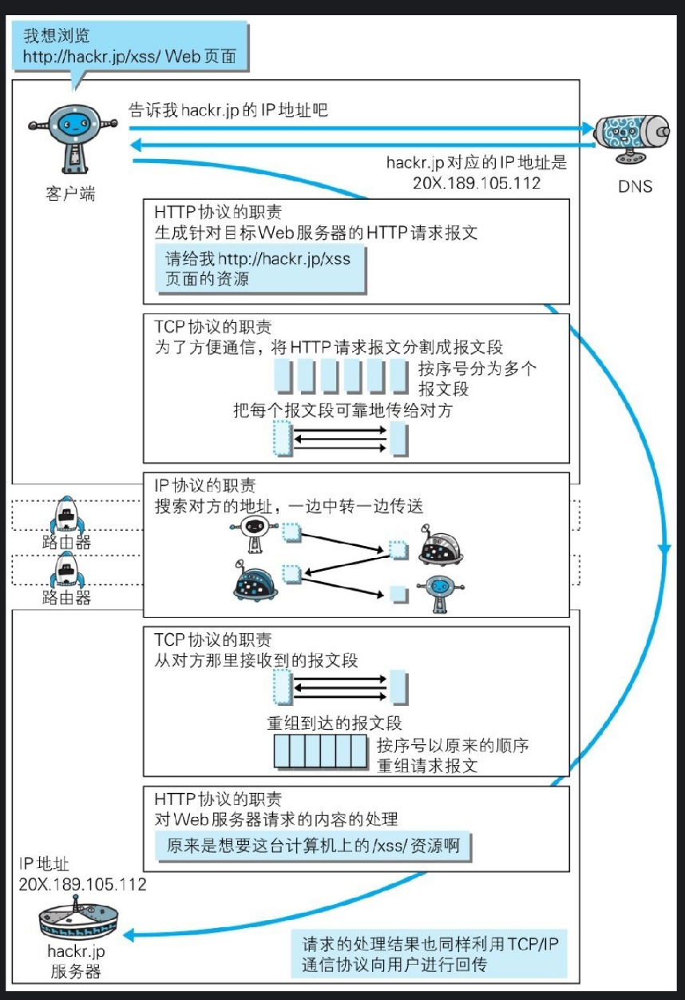

### 访问一个百度，用到了什么协议？

想访问百度
1. 使用dns协议解析出ip地址
2. http协议生成目标服务器的请求报文
3. 方便传输，tcp协议将报文分割成为报文段，三次握手，进行可靠的传输
4. ip协议，搜索地址，一边传送一边中转。
5. 服务器数据链路层收到，tcp报文重组，
6. 使用http协议处理请求的web内容

### 常见的协议
ip协议，tcp协议，http协议，dns协议

### tcp/ip 从底层至顶层共计4层：

+ tcp/ip协议

    + 应用层 -- http协议、dns协议
    + 传输层 -- tcp协议
    + 网络层 -- ip协议
    + 数据链路层 