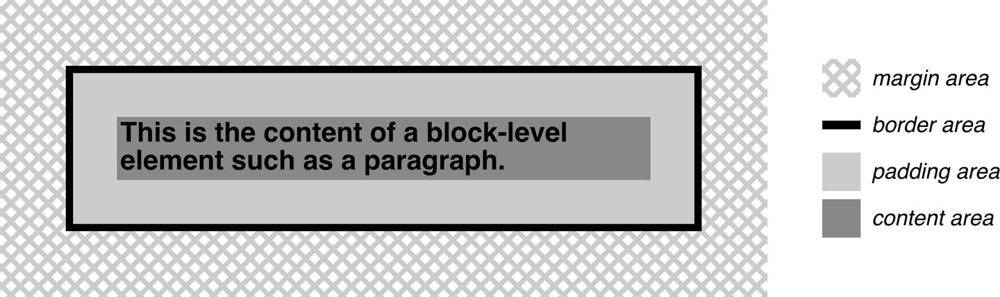

## 盒模型

元素框的中心都有一个内容区域。这个内容区域被可选的填充、边框、轮廓和边距包围。这些区域被认为是可选的，因为它们都可以设置为宽度为 0，从而有效地将它们从元素框中移除。

### border-box - 边框盒子

+  边框颜色

 边框是使用已定义的样式生成的，如实体或 inset，它们的颜色是使用 border-color 属性设置的。如果没有设置颜色，则边框采用元素内容的前景色。 

### padding-box - 边距盒子

### content-box - 内容盒子