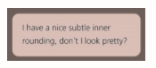

### 1.半透明边框
- Q1. 边框去哪了？假设我们想给一个容器设置一层白色背景和一道半透明白色边框，body 的背景会从它的半透明边框透上来。
```
border: 10px solid hsla(0,0%,100%,.5); 
background: white;

/**看不到半透明的边框**/
```
但我们的边框其实是存在的。默认情况下， 背景会延伸到边框所在的区域下层。

我们所做的事情并没有让body的背景从半透明白色边框处透上来，而是在半透明白色边框处透出了这个容器自己的纯白实色背景。

使用 background-clip 调整。

background-clip 属性的初始值是 border-box，意味着背景会被元素的 border box （边框的外沿框）裁切掉。

如果不希望背景侵入边框所在的范围，我们要做的就是把它的值设为 padding-box，这样浏览器就会用内边距的外沿来把背景裁切掉。

### 2.多重边框
- 1.使用 **box-shadow**  实现多重实线边框(支持逗号分隔语法，可以创建任意数量的投影)
  ```
  background: yellowgreen;
  box-shadow: 0 0 0 10px #655,
              0 0 0 15px deeppink;
  ```
  第四个参数（称作“扩张半径”），通 过指定正值或负值，可以让投影面积加大或者减小。一个正值的扩张半径加上两个为零的偏移量以及为零的模糊值，得到的“投影”其实就像一道**实线边框**。

 投影的行为跟边框不完全一致，因为它**不会影响布局**，而且也不会受到 box-sizing 属性的影响。不过，你还是可以通过内边距或外边 距（这取决于投影是内嵌和还是外扩的）来额外模拟出边框所需要占据的空间。 

上述方法所创建出的假“边框”出现在元素的外圈。它们并**不会响应鼠标事件**，比如悬停或点击。如果这一点非常重要，你可以给 box-shadow 属性加上 inset 关键字，来使投影绘制在元素的内圈。请注意，此时你需要增加额外的内边距来腾出足够的空隙。

- 2.使用outline实现两层边框(边框样式可solid，dashed,thick double)
  
  两层边框，那就可以先设置一层常规边框，再加上 outline（描边）属性来产生外层的边框。
```
background: yellowgreen; 
border: 10px solid #655; 
outline: 5px solid deeppink
```
outline-offset 属性来控制它跟元素边缘之间的间距。

简单的缝边效果 -- outline-offset 设置负值。

只适用于双层“边框”的场景，因为 outline 并不能接受用逗号分隔的多个值。

边框不一定会贴合 border-radius 属性产生的圆角，因此如果元素是圆角的，它的描边可能还是直角的。

### 3.边框内圆角
- Q2. 需要一个容器，只在内侧有圆角，而边框或描边的四个角在外部仍然保持直角的形状。
  
     

  1 . 使用两层div即可。
  
  2 . hack组合技巧
  ```
  background: tan; 
  border-radius: .8em; 
  padding: 1em; 
  box-shadow: 0 0 0 .6em #655; 
  outline: .6em solid #655
  ```       
box-shadow 属性指定的扩张值并不一定等于描边的宽度，我们只需要指定一个足够填补“空隙”的扩张值就可以了。

扩张值如何算？
